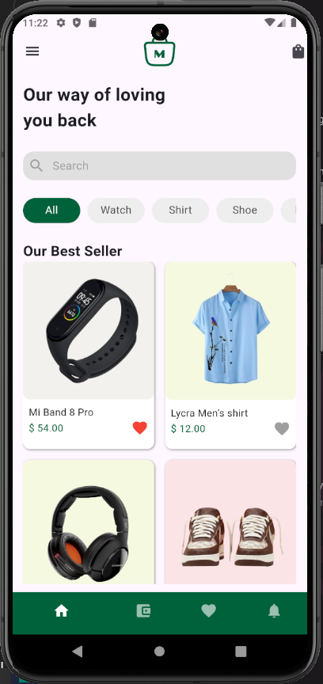
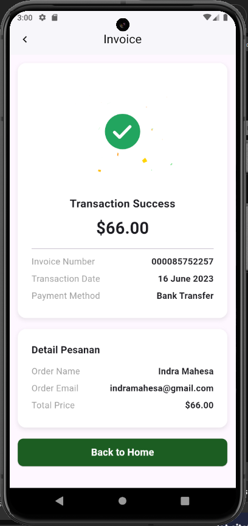

# 🛍️ Aplikasi Online Shop - Flutter UI

## 🎯 Deskripsi Proyek

Ini adalah proyek Flutter yang menampilkan **desain modern UI untuk aplikasi online shop**. Aplikasi ini memiliki design yang bersih dan responsif, cocok untuk aplikasi e-commerce. Implementasi saat ini berfokus pada **silicing UI** sebagai bagian dari tugas **Motion Lab**, dan belum memiliki fungsi backend.

## ✨ Fitur

- **Splash Screen:**
  - Layar pembuka yang menarik yang muncul saat aplikasi diluncurkan.
- **Halaman Login:**
  - Halaman untuk pengguna masuk menggunakan kredensial mereka.
- **Halaman Register:**
  - Halaman untuk pengguna baru mendaftar akun mereka.
- **Halaman Home:**
  - Layout bersih dengan **filter kategori**.
  - Menampilkan grid product **best-seller** dengan gambar, nama, dan harga produk.
  - Ikon hati untuk menandai produk favorit(belum berfungsi).
- **Bottom Navigation Bar:**
  - Navigasi mudah dengan ikon untuk Home, Kategori, Favorit, dan Profil.
- **Desain Modern**
  - Layout responsif untuk berbagai ukuran layar.
  - Tampilan minimalis namun menarik.

## ✨ Fitur yang Telah Dibuat

1. **Halaman Cart (Keranjang Belanja)**

   - Menampilkan daftar item yang dimasukkan ke keranjang.
   - Tombol **+/-** untuk menambah atau mengurangi jumlah item.
   - Tombol **"Buy Now"** yang mengarahkan ke halaman Invoice.

2. **Halaman Invoice**

   - Menampilkan informasi transaksi seperti:
     - Nama Pemesan: `Indra Mahesa`
     - Email Pemesan: `indramahesa@gmail.com`
     - Total Harga: `$66.00`
   - Tombol **"Back to Home"** dengan lebar penuh yang mengarahkan kembali ke halaman utama.

3. **Kontrol State**
   - Menggunakan **GetX** sebagai state management untuk kontrol item pada cart.

## 📸 Preview

### **Preview**



### **Halaman Cart**


### **Halaman Invoice**



## 🛠️ Teknologi yang Digunakan

- **Flutter**: Framework utama untuk pengembangan aplikasi.
- **Dart**: Bahasa pemrograman untuk logika aplikasi.
- **Widget**:
  - Stateless dan Stateful Widgets.
  - GridView untuk menampilkan produk.
- **GetX**: State management untuk kontrol kuantitas item.

## Konversi Proyek ke Pola GetX

### Ringkasan

Proyek ini adalah aplikasi Flutter yang telah di-refactor untuk menerapkan pola **GetX**. Fokus utama dari refactoring ini adalah:

- Mengonversi struktur proyek agar sesuai dengan pola GetX.
- Memisahkan logika antarmuka pengguna (UI) dan logika bisnis menggunakan controller.
- Memastikan aplikasi lebih mudah untuk dikembangkan dan dipelihara di masa depan.

### Perubahan yang Dilakukan

1. **HomePage**:

   - Di-refactor untuk menggunakan `HomeController` yang mengelola logika UI seperti kategori dan navigasi.
   - Semua widget stateful dikonversi menjadi widget stateless.
   - Menggunakan GetX untuk manajemen state.

2. **DetailPage**:

   - Di-refactor untuk menggunakan `DetailController` yang mengelola detail produk dan aksi seperti "Add to Bag".
   - Reaktivitas ditingkatkan dengan menggunakan `Obx` untuk pembaruan dinamis.

3. **Umum**:
   - Menggunakan **GetX** untuk manajemen state dan navigasi.
   - Navigasi disederhanakan dengan `Get.to` dan `Get.back`.

## Working with API 🔥

### Perubahan yang dilakukan:

1. Mengonversi project menjadi GetX Pattern menggunakan Get CLI.
2. Mengubah seluruh UI menjadi Stateless Widget.
3. Memindahkan semua logic dari UI ke Controller.
4. Membuat Service API untuk fitur:
   - Get All Products by Category
   - Get Category List
   - Get Single Product
5. Mengganti data dummy dengan data dari API.

### Cara Menjalankan

1. Pastikan Flutter telah terinstal dan dikonfigurasi di perangkat Anda.
2. Clone repository ini dan navigasi ke folder proyek:
   ```bash
   git clone <repository-link>
   cd <project-folder>
   ```
3. Instal dependensi:
   ```bash
   flutter pub get
   ```
4. Jalankan aplikasi:
   ```bash
   flutter run
   ```

### Dependensi

- **Flutter**: Versi 3.x atau lebih baru.
- **GetX**: ^4.6.5

### Kredit

Proyek ini diselesaikan sebagai bagian dari tugas Motion Lab. Terima kasih kepada tim atas dukungan dan bimbingannya.
